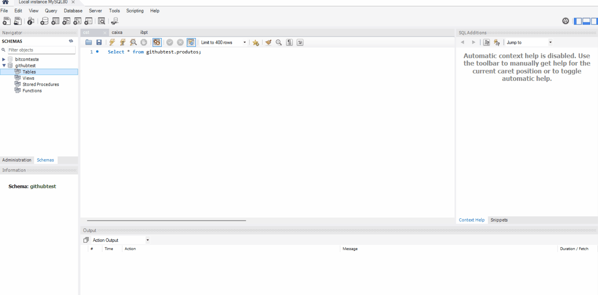

# delphi-firebird-mysql-synchronizer

Data synchronizer between Firebird and MySQL developed in Delphi.

This project is a **unidirectional synchronization tool** developed in Delphi 10.4 (32-bit). Its main purpose is to read the structure and data from a Firebird 3.5 database and replicate it to a MySQL 8.0.43 database, keeping MySQL as an up-to-date mirror of Firebird.


## ✨ Key Features

* **Schema Replication:** Automatically creates tables in MySQL based on the existing Firebird schema, converting data types in a compatible way.
* **Data Synchronization (Upsert):** Inserts new records and updates existing ones from Firebird to MySQL efficiently using the `INSERT ... ON DUPLICATE KEY UPDATE` statement.
* **Change Tracking:** Uses an `UPDATED` field and Firebird triggers to mark inserted or modified records, ensuring only the necessary data is synchronized.
* **Deletion Handling:** Employs a `LOG_DELETIONS` table and delete triggers in Firebird to replicate record deletions in the MySQL database.
* **Operation Logging:** Generates a `synchronization_log.txt` file with a detailed record of operations and possible errors during the process.



## 🛠️ Technologies and Prerequisites

* **Language:** Delphi 10.4 (32-bit)
* **Source Database:** Firebird 3.5
* **Target Database:** MySQL 8.0.43
* **Access Components:** InterBase Express (IBX) for Firebird and FireDAC for MySQL.
* **DB Tools:** IBExpert (Firebird) and MySQL Workbench (or similar).
* **IDE:** Embarcadero Delphi 10.4 32-Bits

### MySQL Driver

It is **mandatory** to use the **32-bit** `libmysql.dll` driver. Since the Delphi IDE used is a 32-bit environment, the database connection driver must match the same architecture to ensure compatibility. Download link: https://dev.mysql.com/downloads/connector/c/

## ⚙️ Setup and Usage

Setting up the environment is a manual process and requires the following steps:

1.  **Database Creation:** Manually create empty databases in Firebird and MySQL. The application does not create databases; it only manages tables and data within them.

2.  **Delphi Environment:**
    * Open the project in Embarcadero Delphi.
    * On the form, manually add all components listed in the `type` section of the code (e.g., `TFDConnection`, `TIBDatabase`, `TButton`, `TProgressBar`, etc.).
    * Connect the properties and events of the components according to the code implementation.
    * Configure the `TIBDatabase` (IBX) component properties to connect to your Firebird database.

3.  **Configuration File (`.ini`):**
    * MySQL connection credentials are loaded from a configuration file. Create a file with the same name as your executable and the `.ini` extension (e.g., `Synchronizer.ini`).
    * This `.ini` file and the `libmysql.dll` must be in the same folder as the generated executable (usually `Win32\Debug` or `Win32\Release`).
    * Add the following structure to the file, filling in your details:

    ```ini
    [MySQL]
    DriverID=MySQL
    Database=your_mysql_database_name
    User=your_mysql_user
    Password=your_mysql_password
    Server=localhost
    Port=3306
    VendorLib=C:\Path\To\Executable\libmysql.dll
    ```
   *Repeat the process without the `VendorLib` part for Firebird.

4.  **MySQL Permissions:**
    * Ensure the MySQL user in the `.ini` file has the necessary permissions (`SELECT`, `INSERT`, `UPDATE`, `DELETE`, `CREATE`, `ALTER`) on the target database.
    * **Note:** If you have just created the user or changed permissions manually via command line, it may be necessary to run `FLUSH PRIVILEGES;` in MySQL to apply the changes immediately. This command is crucial for Delphi-MySQL connectivity.

5.  **Execution:**
    * Compile and run the application. The synchronization process will start when the corresponding event is triggered (e.g., a button click).

## ⚠️ Important Notes

* **Batch Updates:** By default, synchronization is done record by record. For scenarios with a large amount of data, it is recommended to adapt the code to use batch updates (such as FireDAC's `Array DML`) for better performance.
* **User Interface (UI):** Visual components (buttons, progress bars, labels) must be added and positioned according to the `.dfm` file in the form. The provided code contains only the logic.
* **Security:** Connection credentials are stored in plain text in the `.ini` file. For production environments, consider using more secure methods to manage these credentials.
* **About the INI and LIBS:** All files containing information that is used in the project must be added to the directory where the program compiles.
